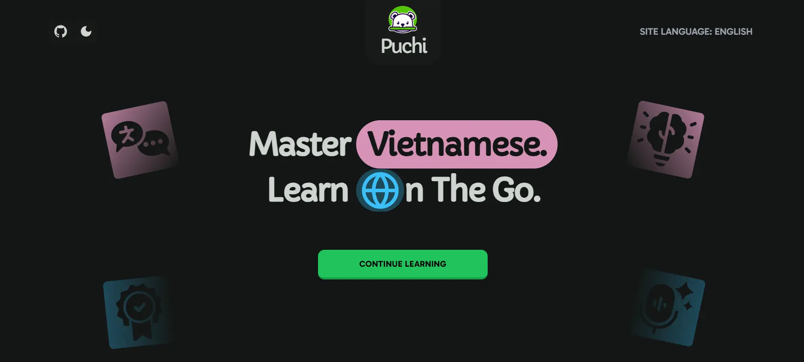

# Puchi

Master Vietnamese. Learn On The Go.

  

## Table of Contents

- [Introduction](#introduction)
- [Getting Started](#getting-started)
- [Key Features](#key-features)
- [Performance](#performance)
- [Usage](#usage)
- [Contributing](#contributing)
- [License](#license)
- [Contact](#contact)

## Introduction

Puchi is an innovative platform designed to help users master Vietnamese. With Puchi, you can learn Vietnamese anytime and anywhere, making it perfect for busy learners who want to study on the go.

## Getting Started

To get started with Puchi:

1. Visit [puchi.io.vn](https://puchi.io.vn/), or search for it here:
   

     
     
*(Hint: You’ll find it right at the top of the search results! 😘)*

   

2. Sign up and choose your learning plan.
3. Begin your Vietnamese learning journey today!

## Key Features

- 🌐 **Built with Next.js 15** & Server Actions for fast and efficient server-side rendering.
- 🔄 **React 19 Integration** for improved interactivity and dynamic updates without compromising performance.
- 🎨 **Beautiful Component System** using Shadcn UI for a clean and consistent design.
- 📱 **Responsive Design** for optimal experience on mobile and desktop devices.
- 🌍 **Internationalization (i18n)** support for multiple languages.
- 🔒 **Secure Authentication** powered by Clerk to keep your data safe.
- 📊 **Analytics Integration** to track user progress and optimize the learning experience.
- 🚀 **Optimized Performance** with efficient resource handling and caching.

## Performance

Puchi is optimized for speed and performance. Check the latest Google PageSpeed Insights score below:

Click the badge above to see Puchi’s current performance score and suggestions for further optimization.

## Usage

Puchi is designed to be accessible on both mobile and desktop devices. Simply log in, select your course, and begin learning.

## Contributing

We welcome contributions! Feel free to open issues, submit pull requests, or provide feedback to help us improve Puchi.

## License

Puchi is licensed under the MIT License. See the [LICENSE](./LICENSE) file for more details.

## Contact

For any questions or support, please contact us at:

> Email: lehoan.dev@gmail.com 
> Facebook: [Lê Công Hoan](https://www.facebook.com/hoanit02)

---

Puchi © 2025. All rights reserved.
