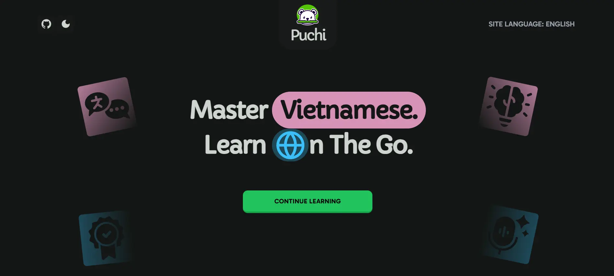

# Puchi

Master Vietnamese. Learn On The Go.

<div align="center">
  <a href="https://puchi.io.vn/">
    
  </a>
</div>

## Table of Contents

- [Introduction](#introduction)
- [Getting Started](#getting-started)
- [Development](#development)
- [Key Features](#key-features)
- [Performance](#performance)
- [Usage](#usage)
- [Contributing](#contributing)
- [License](#license)
- [Contact](#contact)

## Introduction

Puchi is an innovative platform designed to help users master Vietnamese. With Puchi, you can learn Vietnamese anytime and anywhere, making it perfect for busy learners who want to study on the go.

## Getting Started

To get started with Puchi:

1. Visit [puchi.io.vn](https://puchi.io.vn/), or search for it here:
   <div align="center">
     <a href="https://www.google.com/search?q=puchi+vietnamese">
       
     </a>
     <p>*(Hint: You'll find it right at the top of the search results! 😘)*</p>
   </div>

2. Sign up and choose your learning plan.
3. Begin your Vietnamese learning journey today!

## Development

### Setup

To set up the development environment:

1. Clone the repository
2. Install dependencies using Bun:
   ```bash
   bun install
   ```
3. Run the development server:
   ```bash
   bun run dev
   ```
4. Open [http://localhost:3000](http://localhost:3000) in your browser

> **Note:** Dùng **Bun** để install dependencies, nhưng build bằng **Node.js** (Next.js 16 chưa support Bun build).

### Available Scripts

- `bun run dev` - Start the development server
- `bun run build` - Build the application for production
- `bun run start` - Start the production server
- `bun run lint` - Run ESLint

## Key Features

- 🌐 **Built with Next.js 16** & Server Actions for fast and efficient server-side rendering.
- 🔄 **React 19 Integration** for improved interactivity and dynamic updates without compromising performance.
- 🎨 **Modern Styling with Tailwind CSS v4** - Latest utility-first CSS framework for beautiful and responsive designs.
- 🧩 **Beautiful Component System** using Shadcn UI for a clean and consistent design.
- ⚡ **Powered by Bun** - Fast JavaScript runtime and package manager for optimal development experience.
- 📱 **Responsive Design** for optimal experience on mobile and desktop devices.
- 🌍 **Internationalization (i18n)** support for multiple languages via next-intl.
- 🔒 **Secure Authentication** powered by [Limen](https://limenauth.dev/) (session cookie + opaque Bearer).
- 📊 **Analytics Integration** to track user progress and optimize the learning experience.
- 🚀 **Optimized Performance** with efficient resource handling and caching.

## Performance

Puchi is optimized for speed and performance. Check the latest Google PageSpeed Insights score below:

[](https://pagespeed.web.dev/analysis?url=https%3A%2F%2Fpuchi.io.vn%2Fen)

Click the badge above to see Puchi's current performance score and suggestions for further optimization.

## Usage

Puchi is designed to be accessible on both mobile and desktop devices. Simply log in, select your course, and begin learning.

## Contributing

We welcome contributions! Feel free to open issues, submit pull requests, or provide feedback to help us improve Puchi.

## License

Puchi is licensed under the MIT License. See the [LICENSE](./LICENSE) file for more details.

## Contact

For any questions or support, please contact us at:

> Email: lehoan.dev@gmail.com</br>
> Facebook: [Lê Công Hoan](https://www.facebook.com/hoanit02)

---

## Architecture

```
User → Next.js PWA (CDN) → Envoy Gateway → Go Services → PostgreSQL/NATS/R2
         (puchi.io.vn)        (API GW)      (Kratos v3)    (K3s + Cloudflare)
```

### Tech Stack

| Layer | Technology |
|-------|-----------|
| Framework | Next.js 16 (App Router) + React 19 |
| Styling | Tailwind CSS v4 + Shadcn UI (New York) |
| State | Zustand v5 |
| Runtime | Bun (install) + Node.js (build) |
| i18n | next-intl (9 languages) |
| Animation | Motion + Rive |
| Auth | **Limen** — `limen-auth/react` + bearerPlugin |

### Repos

| Repo | Description |
|------|-------------|
| [puchi-frontend](https://github.com/puchidemy/puchi-frontend) | Next.js PWA (this repo) |
| [puchi-backend](https://github.com/puchidemy/puchi-backend) | Go microservices monorepo (Kratos v3, 5 services) |
| [puchi-infra](https://github.com/puchidemy/puchi-infra) | ArgoCD GitOps on K3s |

---

Puchi © 2025. All rights reserved.
