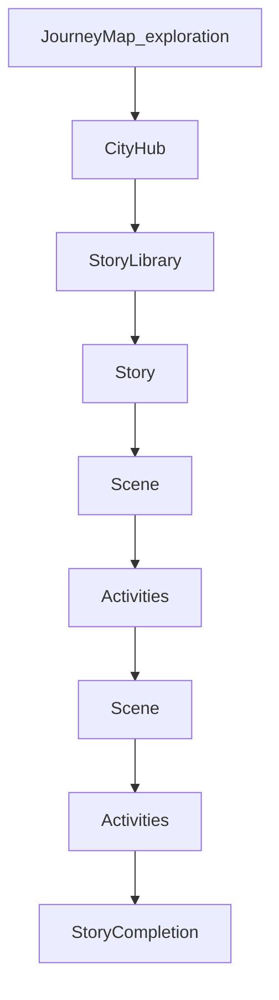

# Story-first Learn Architecture Design

**Status:** Approved (plan locked)  
**Date:** 2026-07-20  
**Scope:** Product IA + learn-service schema/API contracts + frontend routes (design only)  
**Supersedes:** Chapter / Landmark path in `2026-07-20-puchi-journey-map-design.md` and region soft-lock model  
**Related:** `2026-07-17-learn-service-reorg-design.md` (guest/claim topology still applies; curriculum model replaced)

---

## 1. Executive summary

Refactor Learn from **Course → Unit → Skill → Lesson → Exercise** (and the FE Chapter/Landmark map) to a **Story-first** model:

```
Journey Map → City → Story Library → Story → Scenes → Activities
```

MVP delivers new schema/API in `learn-service` plus frontend routes/UI. Cities are never locked. Difficulty is **CEFR A1–C2** on Stories. The existing exercise engine (`select` / `match` / `listen` / `dictate` + attempt grading) is reused as **Activities under Scenes**. Guest soft-gate = **3 completed Scenes**.

This spec is the Phase 1 deliverable. Implementation follows in later phases (backend → FE shell → Story player → cleanup).

---

## 2. Locked decisions

| # | Topic | Decision |
|---|--------|----------|
| 1 | MVP scope | Frontend + learn schema/API mới. Seed 8 city shells + ≥1 Hanoi A1 Story. Không giữ landmark/chapter làm path chính. |
| 2 | Difficulty | CEFR `A1`–`C2` trên **Story**. City không khóa; filter/recommend theo level learner. |
| 3 | Player reuse | Giữ engine exercise hiện tại; bọc thành **Activity gắn Scene**. Flow UI: Scene → Practice → Scene (không dump hết exercise cuối Story). |
| 4 | Map | Vietnam diorama board giữ lại; hotspots = **8 cities**, all interactive/unlocked. |
| 5 | Guest soft-gate | **3 completed Scenes** (giữ limit 3; đo theo Scene để trial length ổn định). |
| 6 | Legacy content | Không migrate 1:1 Unit1 lessons → Stories. Seed Story mới. Legacy tables có thể tạm giữ unused / feature-flag đến khi cleanup. |
| 7 | Progression | Theo difficulty/level + Story/Scene progress — **không** theo geography (north→south). |

### Explicit non-goals (MVP)

- Full dialogue-heavy stories
- Auto-generating activities from LLM in production
- Migrating old trial Unit1 lessons 1:1 as Stories
- Keeping landmark lock / north→south gate
- CMS admin, speak grading, multi-course trial redesign beyond soft-gate metric change

---

## 3. Product information architecture



| Layer | Role | UX notes |
|-------|------|----------|
| **Journey Map** | Exploration only | 8 cities MVP, all unlocked; pan/zoom diorama; tap city → City hub |
| **City Hub** | Content hub for a destination | Continue / Recommended / tags / Saved; empty library → “Coming soon” (city vẫn mở) |
| **Story Library** | List/filter Stories in city | Filter by CEFR, tags; sections e.g. Continue, Recommended, All |
| **Story** | SSOT learning unit | Title, cover, summary, CEFR, tags, audio, vocab/grammar focus, est. time |
| **Scene** | Narrative block | ~30–60 words, ~80% narration; illustration + audio; optional light dialogue |
| **Activity** | Practice step under Scene | Types reuse exercise engine; 1–N per scene; not every type every scene |
| **Story Completion** | End screen | Vocab / grammar / listening minutes / cultural fact / reward (not XP-only) |

**Progression model:** Geography is discovery. Skill progression is CEFR + completed Stories/Scenes.

---

## 4. Story player flow

1. Load Story + ordered Scenes + Activities per Scene.
2. For each Scene:
   - Show illustration + narration/audio (+ light dialogue if any).
   - CTA **Continue to practice**.
   - Run 1–N Activities (reuse grading via attempt/answer).
3. Advance to next Scene until done.
4. Completion screen: summary metrics + cultural beat + reward.

Guest hitting soft-gate (3 completed Scenes) → existing soft-gate dialog → login/signup (Limen) → guest claim (unchanged topology).

---

## 5. Data model (learn service)

Replace the mental model Course→Unit→Skill→Lesson with new tables. **Do not rename Skill/Lesson in-place.** Add a new migration (e.g. `003_story_schema.sql`).

### 5.1 Tables

#### `learn.cities`

| Column | Type | Notes |
|--------|------|-------|
| `id` | UUID PK | `uuidv7()` |
| `slug` | TEXT UNIQUE | e.g. `hanoi`, `ha-long` |
| `name` | TEXT | Display name (or i18n key) |
| `position` | INT | Map / list order |
| `map_x` | REAL | Normalized hotspot 0–1 |
| `map_y` | REAL | Normalized hotspot 0–1 |
| `cover_url` | TEXT NULL | Hub hero art |
| `blurb` | TEXT NULL | Short city intro |
| `created_at` | TIMESTAMPTZ | default `now()` |

#### `learn.stories`

| Column | Type | Notes |
|--------|------|-------|
| `id` | UUID PK | |
| `city_id` | UUID FK → cities | |
| `slug` | TEXT | Unique per city (`UNIQUE (city_id, slug)`) |
| `title` | TEXT | |
| `summary` | TEXT | |
| `cover_url` | TEXT NULL | |
| `cefr` | TEXT | `CHECK (cefr IN ('A1','A2','B1','B2','C1','C2'))` |
| `tags` | TEXT[] | e.g. `{food,travel}` |
| `audio_url` | TEXT NULL | Optional full-story / intro audio |
| `vocab_focus` | TEXT[] NULL | Surface on completion |
| `grammar_focus` | TEXT[] NULL | |
| `est_minutes` | INT NULL | Estimated time |
| `position` | INT | Order within city library |
| `status` | TEXT | `draft` \| `published` (MVP seed = published) |
| `created_at` | TIMESTAMPTZ | |

#### `learn.scenes`

| Column | Type | Notes |
|--------|------|-------|
| `id` | UUID PK | |
| `story_id` | UUID FK → stories | |
| `position` | INT | `UNIQUE (story_id, position)` |
| `title` | TEXT NULL | Optional beat title |
| `narration` | TEXT | Main prose (~30–60 words target) |
| `dialogue_json` | JSONB NULL | Optional light dialogue turns |
| `illustration_url` | TEXT NULL | |
| `audio_url` | TEXT NULL | Scene narration audio |
| `created_at` | TIMESTAMPTZ | |

#### `learn.activities`

| Column | Type | Notes |
|--------|------|-------|
| `id` | UUID PK | |
| `scene_id` | UUID FK → scenes | |
| `position` | INT | `UNIQUE (scene_id, position)` |
| `type` | TEXT | `CHECK (type IN ('select','match','listen','dictate'))` — same as legacy exercises |
| `prompt` | JSONB | Same shape as `learn.exercises.prompt` |
| `answer` | JSONB | Same shape as `learn.exercises.answer` |
| `created_at` | TIMESTAMPTZ | |

Optional: `learn.activity_assets` mirroring `exercise_assets` if media roles are needed (MVP may reuse CDN URLs in prompt JSON).

#### Progress

| Table | Key | Fields |
|-------|-----|--------|
| `learn.user_story_progress` | `(owner_type, owner_id, story_id)` | `status` (`not_started`\|`in_progress`\|`completed`), `xp_earned`, `updated_at` |
| `learn.user_scene_progress` | `(owner_type, owner_id, scene_id)` | `status`, `updated_at` |

`owner_type` / `owner_id` semantics match existing guest/user progress (`user` \| `guest`).

#### Attempts (activities)

Reuse attempt pattern; prefer **new** tables keyed by activity to avoid coupling to `lesson_id`:

| Table | Notes |
|-------|--------|
| `learn.activity_attempts` | `id`, `owner_type`, `owner_id`, `story_id`, `scene_id`, `status`, `session_xp`, timestamps |
| `learn.activity_attempt_answers` | `attempt_id`, `activity_id`, `payload`, `correct`, `created_at` |

Grading rules stay identical to exercise grading (rule-based by `type`).

#### Guests

`learn.guests` unchanged. Soft-gate count = number of scenes with `user_scene_progress.status = 'completed'` for that guest (≥ 3 → `GUEST_SOFT_GATE`).

### 5.2 Entity mapping (legacy → Story-first)

| Legacy | Story-first | Migration action |
|--------|-------------|------------------|
| Course / Unit | *(no direct equivalent)* | Journey = map of Cities; no unit gate |
| Skill / Chapter / Landmark | **City** (hub only; not a skill) | FE config → `cities` + map pins |
| Lesson | **Story** | New content; do not 1:1 migrate |
| *(narrative inside lesson)* | **Scene** | New |
| Exercise | **Activity** (under Scene) | Same types + prompt/answer JSON |
| `user_lesson_progress` | `user_story_progress` + `user_scene_progress` | Parallel tables |
| Guest soft-gate: 3 lessons | **3 completed Scenes** | Update gate metric |

---

## 6. API contracts

Base path remains `/v1/learn/*`. Guest session + claim RPCs stay. New RPCs below; legacy Unit/Lesson RPCs may remain until cleanup phase but are **not** the main path.

Auth: Bearer user **or** guest cookie (same as today). Public read for published city/story metadata is allowed for guests; mutating progress/attempts enforce soft-gate.

### 6.1 ListCities

```
GET /v1/learn/cities
rpc ListCities(ListCitiesRequest) returns (ListCitiesResponse)
```

**Request:** empty (optional future: `cefr_hint`)

**Response:**

```json
{
  "cities": [
    {
      "id": "uuid",
      "slug": "hanoi",
      "name": "Hà Nội",
      "position": 1,
      "map_x": 0.42,
      "map_y": 0.28,
      "cover_url": "https://cdn…/hanoi-cover.webp",
      "blurb": "…",
      "story_count": 1,
      "completed_story_count": 0
    }
  ]
}
```

All cities returned as open (no `locked` status).

### 6.2 GetCity

```
GET /v1/learn/cities/{slug}
rpc GetCity(GetCityRequest) returns (GetCityResponse)
```

**Response:**

```json
{
  "city": { "...": "City" },
  "stories": [
    {
      "id": "uuid",
      "slug": "pho-morning",
      "title": "Morning Phở",
      "summary": "…",
      "cover_url": "…",
      "cefr": "A1",
      "tags": ["food", "daily"],
      "est_minutes": 8,
      "status": "published",
      "progress_status": "not_started"
    }
  ],
  "continue_story_id": null,
  "recommended_story_ids": ["uuid"]
}
```

Empty `stories` → FE shows Coming soon; city still valid.

### 6.3 GetStory

```
GET /v1/learn/stories/{id}
rpc GetStory(GetStoryRequest) returns (GetStoryResponse)
```

**Response:**

```json
{
  "story": {
    "id": "uuid",
    "city_id": "uuid",
    "city_slug": "hanoi",
    "slug": "pho-morning",
    "title": "Morning Phở",
    "summary": "…",
    "cover_url": "…",
    "cefr": "A1",
    "tags": ["food"],
    "audio_url": null,
    "vocab_focus": ["phở", "nóng"],
    "grammar_focus": ["là"],
    "est_minutes": 8
  },
  "scenes": [
    {
      "id": "uuid",
      "position": 1,
      "title": "At the stall",
      "narration": "…",
      "dialogue_json": null,
      "illustration_url": "…",
      "audio_url": "…",
      "progress_status": "not_started",
      "activities": [
        {
          "id": "uuid",
          "position": 1,
          "type": "select",
          "prompt_json": "{...}"
        }
      ]
    }
  ],
  "progress_status": "not_started"
}
```

**Note:** `answer` / answer keys must **not** be returned to the client in GetStory (same discipline as lesson player: grade server-side). `prompt_json` only on activities.

### 6.4 Activity start / answer / complete

#### StartActivity (or StartScenePractice)

```
POST /v1/learn/scenes/{scene_id}/activities/start
rpc StartActivity(StartActivityRequest) returns (StartActivityResponse)
```

Creates/resumes an `activity_attempt` for the scene’s activity sequence.

```json
// Response
{ "attempt_id": "uuid" }
```

Soft-gate: if guest already has ≥ 3 completed scenes and this start would continue past trial, return `403` with reason `GUEST_SOFT_GATE` (mirror existing codes in FE `SOFT_GATE_CODES`).

#### SubmitActivityAnswer

```
POST /v1/learn/activity-attempts/{attempt_id}/answer
rpc SubmitActivityAnswer(SubmitActivityAnswerRequest) returns (SubmitActivityAnswerResponse)
```

```json
// Request
{
  "attempt_id": "uuid",
  "activity_id": "uuid",
  "payload_json": "{...}"
}
// Response
{ "correct": true }
```

Reuses existing grading by activity `type`.

#### CompleteScene

```
POST /v1/learn/scenes/{id}/complete
rpc CompleteScene(CompleteSceneRequest) returns (CompleteSceneResponse)
```

Marks scene completed (all required activities in attempt done or scene marked complete per biz rules). Increments soft-gate counter for guests.

```json
{
  "scene_completed": true,
  "story_completed": false,
  "completed_scene_count": 2,
  "soft_gate": false
}
```

#### CompleteStory

```
POST /v1/learn/stories/{id}/complete
rpc CompleteStory(CompleteStoryRequest) returns (CompleteStoryResponse)
```

```json
{
  "xp": 20,
  "story_completed": true,
  "summary": {
    "vocab_focus": ["phở", "nóng"],
    "grammar_focus": ["là"],
    "listening_seconds": 90,
    "cultural_fact": "…"
  }
}
```

### 6.5 Proto sketch (additive)

```protobuf
rpc ListCities(ListCitiesRequest) returns (ListCitiesResponse) {
  option (google.api.http) = { get: "/v1/learn/cities" };
}
rpc GetCity(GetCityRequest) returns (GetCityResponse) {
  option (google.api.http) = { get: "/v1/learn/cities/{slug}" };
}
rpc GetStory(GetStoryRequest) returns (GetStoryResponse) {
  option (google.api.http) = { get: "/v1/learn/stories/{id}" };
}
rpc StartActivity(StartActivityRequest) returns (StartActivityResponse) {
  option (google.api.http) = {
    post: "/v1/learn/scenes/{scene_id}/activities/start"
    body: "*"
  };
}
rpc SubmitActivityAnswer(SubmitActivityAnswerRequest) returns (SubmitActivityAnswerResponse) {
  option (google.api.http) = {
    post: "/v1/learn/activity-attempts/{attempt_id}/answer"
    body: "*"
  };
}
rpc CompleteScene(CompleteSceneRequest) returns (CompleteSceneResponse) {
  option (google.api.http) = {
    post: "/v1/learn/scenes/{id}/complete"
    body: "*"
  };
}
rpc CompleteStory(CompleteStoryRequest) returns (CompleteStoryResponse) {
  option (google.api.http) = {
    post: "/v1/learn/stories/{id}/complete"
    body: "*"
  };
}
```

### 6.6 NATS events

Prefer during transition:

| Event | When | Consumers |
|-------|------|-----------|
| `learn.scene.completed` | Scene completed (user only; not guest) | Core (optional XP/streak hooks) |
| `learn.story.completed` | Story completed (user only) | Core |

Dual-publish `learn.lesson.completed` only if Core still requires it temporarily; remove in cleanup.

---

## 7. Seed MVP

### 7.1 Eight cities (shells)

| # | slug | Name |
|---|------|------|
| 1 | `hanoi` | Hà Nội |
| 2 | `ha-long` | Hạ Long |
| 3 | `hue` | Huế |
| 4 | `hoi-an` | Hội An |
| 5 | `da-nang` | Đà Nẵng |
| 6 | `hcmc` | TP. Hồ Chí Minh |
| 7 | `can-tho` | Cần Thơ |
| 8 | `phu-quoc` | Phú Quốc |

All have map pins + metadata. Cities 2–8: `story_count = 0` → FE empty/Coming soon. Decorative islands remain non-interactive if desired (same as prior map art).

### 7.2 Hanoi A1 story (playable)

- **City:** `hanoi`
- **Story:** A1, ~2–3 Scenes, mixed Activities (read/listen/vocab/quiz via `select` / `match` / `listen` / `dictate`)
- **Example title (seed):** “Morning Phở” / i18n keys as needed
- Scenes: short narration + illustration placeholders; ≥1 activity per scene
- Do **not** port Unit1 lesson IDs

Seed lives in learn migrations (e.g. `004_seed_story_mvp.sql`) alongside city inserts.

---

## 8. Migration notes vs legacy Unit / Skill / Lesson

| Area | Approach |
|------|----------|
| Schema | Additive migration for cities/stories/scenes/activities/progress/attempts. Keep `units`/`skills`/`lessons`/`exercises` until cleanup. |
| Config | Remove FE dependency on `trial_unit_id` for main path; soft-gate uses scene count. Guest claim merge must include story/scene progress (extend claim semantics in backend phase). |
| API | Ship Story RPCs; deprecate GetUnit/GetLesson/StartLesson/CompleteLesson on main FE path; delete in cleanup. |
| FE routes | See §9; `/learn/chapter/*` → redirect to city or 410. |
| i18n | `Learn.Journey.*` chapter copy → `Learn.City.*` / `Learn.Story.*`. |
| Map config | `lib/journey-map/*` → `lib/journey-cities/*` (city hotspots; **no** chapter-access locks). |
| Content | Fresh Story seed; legacy trial seed unused. |

---

## 9. Frontend routes

| Route | Replaces | UI |
|-------|----------|-----|
| `/learn` | Unit journey map (landmarks) | Journey map of **cities** (no locks) |
| `/learn/city/[citySlug]` | `/learn/chapter/[regionSlug]` | City hub + Story library |
| `/learn/story/[storyId]` | `/lesson/[id]` lesson entry | StoryPlayer: Scene → Activity loop → completion |
| Deprecated | `/learn/chapter/*` | Redirect to mapped city if any, else `/learn` or 410 |

### Key FE touchpoints (implementation phases)

- `UnitLearnView` / `JourneyMapView` → city config, unlock-all
- `ChapterView` → `CityHub` + `StoryLibrary`
- `LessonPlayer` → `StoryPlayer` (scene shell + activity modules)
- `learn-api.ts` / `api-contracts.ts` → city/story/activity contracts
- Soft-gate: count completed Scenes (client + server `GUEST_SOFT_GATE`)

### Map assets

Keep Vietnam board art. Remake hotspot config for 8 cities. Region mask/cutout from landmark era may be retired or adapted to city hit-testing in FE phases — product rule remains: **cities never locked**.

---

## 10. Success criteria

- [ ] `/learn` shows unlock-all **city** map (8 cities).
- [ ] Open Hà Nội → Story library sections (Continue / Recommended / list); other cities open with empty/Coming soon.
- [ ] Play one Hanoi A1 Story end-to-end with interleaved Scene → Activity practice.
- [ ] Guest soft-gate fires after **3 completed Scenes**.
- [ ] No chapter/landmark navigation on the main Learn path.
- [ ] Architecture ready to add many Stories without new nav layers (City → Library scales).
- [ ] Spec + contracts ready for backend schema/proto and FE implementation phases.

---

## 11. Delivery phases (reference)

| Phase | Work |
|-------|------|
| **1 — Spec (this doc)** | Product + API + data model + seed + migration + routes |
| **2 — Backend** | Schema + proto + seed + RPCs + guest gate on scenes |
| **3 — Frontend shell** | Map cities + city hub + story library |
| **4 — Story player** | Scene/Activity loop + completion summary |
| **5 — Cleanup** | Remove chapter routes, landmark config, obsolete i18n; drop dual events / legacy RPCs when safe |

---

## 12. Supersession notice

From this date, **Story-first** is the canonical Learn product IA.

- `docs/superpowers/specs/2026-07-20-puchi-journey-map-design.md` (and the copy under `puchi-frontend/docs/...`) remain historical for map art/pan-zoom technique, but **Chapter / Landmark / skill-lock** product decisions are superseded by this document.
- `2026-07-20-journey-region-mask-cutout-design.md` is art/hit-test technique only; lock semantics no longer apply.
- `2026-07-17-learn-service-reorg-design.md` remains valid for service topology, guest claim, R2; curriculum hierarchy Course→Unit→Skill→Lesson is superseded by City→Story→Scene→Activity.
